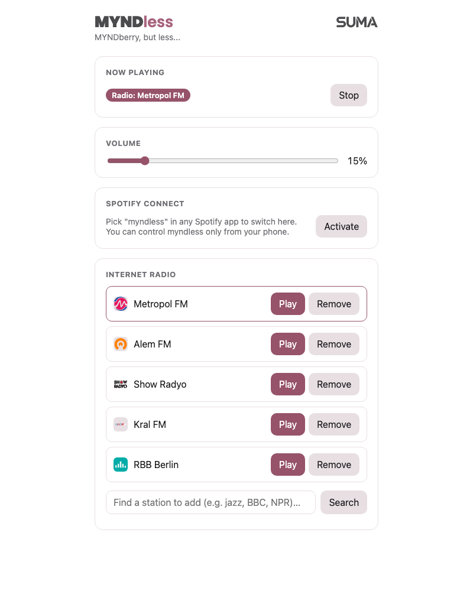

# myndless

A custom Raspberry Pi music hub for a [MYNDberry](https://blog.teufelaudio.com/project-myndberry/)-modified
Teufel MYND speaker — internet radio and Spotify Connect, controlled from a
web UI, talking to the speaker's MCU over its own open-source **Actionslink**
protocol.

## Why this exists

I have a MYNDberry-modded MYND, and it's genuinely a fantastic piece of kit.
The fact that Teufel made it open source is exactly what gave me the
confidence to dig in: I read through their repos to understand how the
speaker and the Raspberry Pi actually talk to each other, then wiped the Pi
completely, installed a plain Raspberry Pi OS Lite on it, and built my own
setup on top of the hardware — just the features I actually wanted, nothing
more. I did the whole thing with Claude Code, end to end, including tuning
the web UI to exactly what I need it for: pulling it up in a browser at home
to switch on Spotify or pick an internet radio station.

There are still a few open ends — I haven't gotten the physical buttons on
the speaker fully wired up yet, and that's something I'm actively still
poking at. But being able to take an open-source device apart, actually
understand it, and rebuild the software around it to fit exactly how I want
to use it has been one of the most fun side projects I've done in a while.
Big thanks to the Teufel team for making that possible.

## What it does

- **Internet radio**, with search-and-add powered by
  [Radio Browser](https://www.radio-browser.info/) right from the web UI.
- **Spotify Connect** — the speaker shows up as a Connect target in any
  Spotify app.
- A small **web UI** (source/station/volume control) reachable from any
  browser on the home network.
- All of it driven by a from-scratch Python implementation of **Actionslink**,
  the same protocol the speaker's MCU used to talk to its Bluetooth module —
  the Pi now stands in for that role.

Verified end to end on real hardware: the UART link to the MCU, I2S audio
output to the speaker's amps, Spotify Connect, internet radio playback, and
volume control from the web UI.

Still being worked on: the speaker's physical Play/Pause and Bluetooth
buttons don't yet forward to this software (volume buttons already work,
since those are handled directly by the speaker's own hardware). See
"What's still open" below.



## Architecture

```
┌──────────────────────────┐        UART (115200 8N1)         ┌────────────────────────────┐
│   MYND main MCU           │◄────────────────────────────────►│  Raspberry Pi Zero 2 W      │
│   (STM32, mynd-firmware)  │      Actionslink protocol         │  (this project)            │
│                           │   over what used to be the        │                            │
│   owns: amp, battery,     │   Bluetooth module's UART pins    │  myndlink/ - protocol lib   │
│   buttons, LEDs, power    │                                   │  daemon/   - orchestrator + │
└──────────────────────────┘                                   │             audio backends  │
                                                                 │  webui/    - Flask control  │
        ALSA (shared output) ◄───────────────┬────────────────►│             UI + API        │
                     ▲                        │                 └────────────────────────────┘
                     │                        │
              mpv (internet radio)     librespot (Spotify Connect)
```

The Pi's role in the Actionslink protocol is the role the original
Bluetooth/Actions co-processor used to play: it receives commands from the
MCU (`set_volume`, `set_power_state`, `play_sound_icon`, transport controls,
...) and acknowledges/responds to them, and it pushes its own events to the
MCU (`notify_system_ready`, `notify_power_state`, `notify_volume`,
`notify_stream_state`, ...). `daemon/orchestrator.py` is where that's
implemented, on top of `myndlink`'s protocol library.

Only one of {radio, Spotify} is ever meant to be actually producing sound at
a time: starting radio stops `librespot` (there's no local way to "pause" a
remote Spotify Connect session), and Spotify becoming active (via its
`--onevent` hook) stops radio.

## Repo layout

```
myndlink/            Actionslink protocol library
  proto/              vendored .proto sources (from mynd-firmware + nanopb)
  pb/                 generated *_pb2.py (regenerate with scripts/gen_proto.sh)
  crc8.py             CRC-8 implementation
  hdlc.py             HDLC framing (encode + incremental parser)
  client.py           ActionslinkClient: transport + dispatch + convenience API
daemon/
  config.py           env-var-driven configuration
  audio.py            ALSA volume control (shells out to amixer)
  radio.py            internet radio playback via mpv + its JSON IPC socket
  radio_browser.py    Radio Browser API client (station search, used by the web UI)
  spotify.py          Spotify Connect via librespot (process mgmt + onevent hook)
  orchestrator.py     wires myndlink <-> audio backends; the real protocol handlers
  main.py             process entrypoint (python -m daemon.main)
  stations.json       default internet radio station list
webui/
  app.py              Flask app: status/radio/volume/spotify API + onevent receiver
  templates/index.html  control page
systemd/
  myndless.service    systemd unit installed by the setup script
scripts/
  setup_pi.sh          Raspberry Pi OS setup (UART, audio, packages, venv, service)
  uart_probe.py        standalone Actionslink link diagnostic (no hardware guesswork)
  gen_proto.sh         regenerate myndlink/pb/*_pb2.py from myndlink/proto/*.proto
tests/                unit + integration tests, all runnable without real hardware
reference/            vendored upstream repos for protocol/hardware reference (gitignored)
  mynd-firmware/       github.com/teufelaudio/mynd-firmware
  mynd-hardware/        github.com/teufelaudio/mynd-hardware
```

## Actionslink protocol notes

Documented here for anyone else poking at this hardware. Reverse engineered
from the open-source MCU firmware at
`reference/mynd-firmware/Projects/Mynd/external/teufel/libs/actionslink/`
(see "Setting up `reference/`" below).

**Transport** — `USART1`, **115200 baud, 8N1, no flow control**. A direct
hardware UART (not USB-serial) — on the MYNDberry adapter PCB it's wired
straight to the Pi's GPIO UART pins (`/dev/serial0`).

**Framing** — HDLC-style:
- Frame = `0x7E` + byte-stuffed(header + payload) + `0x7E`
- Escape char `0x7D`, escaped bytes XORed with `0x20`
- 8-byte header: magic (`0x55`) · packet-type+value · transaction id ·
  payload length (u16 LE) · payload CRC-8 · reserved · header CRC-8
- CRC-8: poly `0x07`, init `0x00`, no reflection, xorout `0x00`
- Every frame with a payload must be met with an `ACK`/`NACK` frame (same
  transaction id). 2 retries, 300ms timeout per attempt. Requests
  additionally expect a matching response message after the ACK.

**Messages** — Protocol Buffers (vendored into `myndlink/proto/`). Bytes the
MCU sends are always an `ActionsLink.FromMcu` message; bytes the Pi sends
are always `ActionsLink.ToMcu`. Note: the `MYNDberry` branch of
`mynd-firmware` ships a second, newer RPi-specific protocol dialect
(`actionslink/proto/rpi/`, with a unified play/pause/next/prev action,
host-source LED sync, even WiFi provisioning over Actionslink itself) -
that one is presumably only spoken by MCU firmware actually flashed from
`myndberry-update-firmware-mcu.bin`. This project speaks the older, generic
`eco/message.proto` dialect, which is what a stock-firmware unit uses and
is what's been verified working here.

**Hardware** — the MYNDberry adapter PCB breaks out the Pi's 40-pin header
to the MYND's original Bluetooth-module connector. It also carries a
CH340N USB-UART chip that can reach the MCU's separate debug UART, though
per the [MYNDberry PCB wiki page](https://github.com/teufelaudio/mynd-hardware/wiki/myndberry_pcb)
that line isn't connected by default.

## Getting this running on your own MYNDberry

1. Do the physical MYNDberry install as usual (adapter PCB, Pi Zero 2 W) —
   see the [official guide](https://github.com/teufelaudio/mynd-firmware/wiki/MYNDberry_initial_setup).
   This project runs on plain **Raspberry Pi OS Lite** rather than moOde.
2. Flash Raspberry Pi OS Lite, boot it, and clone this repo onto it.
3. Run the setup script:
   ```bash
   bash scripts/setup_pi.sh
   ```
   This enables the hardware UART (for Actionslink) and I2S audio out (for
   the MYND's amps), sets up an ALSA software-volume control (the DAC has
   no hardware mixer of its own), installs system packages, and installs +
   enables the `myndless` systemd service. It'll also print instructions
   for `librespot` (needed for Spotify Connect - not packaged for Pi OS, so
   it's installed via the [Raspotify](https://github.com/dtcooper/raspotify)
   project's prebuilt binary).
4. `sudo reboot`, then `sudo systemctl start myndless`, then open
   `http://<pi-hostname-or-ip>:8080/`.

Before trusting the full daemon on a new setup, `scripts/uart_probe.py` is a
handy standalone diagnostic for the Actionslink link itself - see its
docstring for usage.

### Setting up `reference/`

`reference/` is gitignored (it's upstream Teufel repos, not ours to
version) but the protocol notes above point into it:

```bash
mkdir -p reference && cd reference
git clone --depth 1 https://github.com/teufelaudio/mynd-firmware.git
git clone --depth 1 https://github.com/teufelaudio/mynd-hardware.git
cd mynd-firmware
git submodule update --init --depth 1 Projects/Mynd/external/thirdparty/nanopb
```

### Development setup

```bash
python3 -m venv .venv
source .venv/bin/activate
pip install -r requirements-dev.txt   # adds grpcio-tools (proto codegen) + pyflakes
```

Run the tests (no hardware, no mpv/librespot/ALSA required - everything's
mocked, or run against a simulated MCU over a pty):

```bash
for f in tests/test_*.py; do python "$f" || break; done
```

Regenerate the protobuf bindings after touching `myndlink/proto/`:

```bash
bash scripts/gen_proto.sh
```

### Using `myndlink` directly

```python
from myndlink.client import ActionslinkClient
import system_pb2  # from myndlink/pb, already on sys.path via client.py

client = ActionslinkClient("/dev/serial0")

def handle_set_audio_source(source, seq):
    import common_pb2, error_pb2
    result = common_pb2.Result()
    result.status.code = error_pb2.Code.Success
    return result

client.on_request("set_audio_source", handle_set_audio_source)
client.start()
client.notify_system_ready()
client.notify_power_state(system_pb2.PowerState.ON)
```

`daemon/orchestrator.py` is the fuller, real implementation of this pattern.

## What's still open

- The speaker's physical Play/Pause and Bluetooth buttons don't yet forward
  anything to this software - the volume buttons already work fine, since
  the speaker's own hardware handles those directly. Getting transport
  buttons wired up is an active work in progress; the web UI is the
  reliable way to control playback for now.
- Spotify Connect play/pause/skip from the speaker's own buttons: vanilla
  `librespot` doesn't expose a local control API for that, so this would
  need `spotifyd` or a librespot fork instead.
- Sound icon playback (chimes for certain MCU-requested events) needs
  `.wav` files dropped into `assets/sound_icons/` - none are bundled yet.

## Thanks

To the Teufel/MYNDberry team for open-sourcing the firmware, hardware
design, and protocol that made a project like this possible in the first
place.
